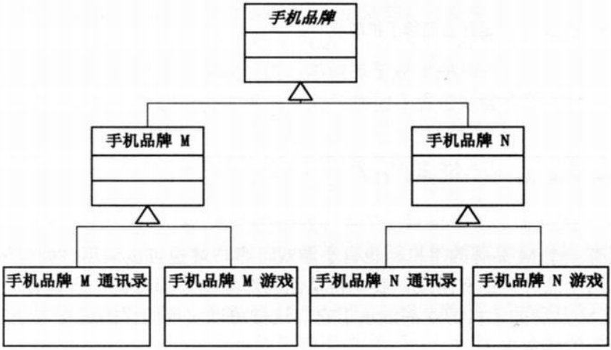
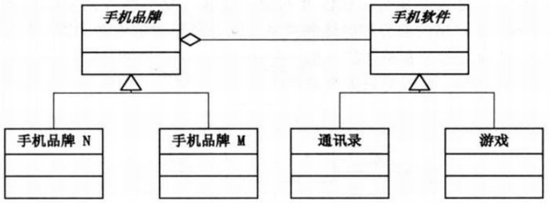

举个例子，有了 windows 操作系统，使得 PC 厂商不关注软件，软件厂商也不过多关注硬件。如果是公司自己开发的操作系统，可能因为难以和其它软件整合而发展缓慢。对硬件或软件而言，应该指定标准。

## 紧耦合

假设此时有 N 品牌的手机，有一个小游戏；此时有 M 牌的手机，也想玩这个游戏。应该创建手机的虚基类，M 手机和 N 手机去继承。因为 M 牌手机和 N 牌手机不同，如果要增加『通讯录』，每个子类（不同牌手机）要实现自己的通讯录；如果增加『音乐软件』，每个子类又要实现自己的音乐软件；如果此时某个公司上市了 O 牌手机，又要增加各自的功能，很累的代码。

- 不能：多一个品牌或多一个功能就多一个类，然后去继承，增加新的功能会很累。

- 对象的继承关系在编译时期定义好，无法在运行时改变从父类继承的实现。
- 子类的实现与父类有紧密的关系，父类实现中任何变化必然会导致子类发生变化。
- 需要复用子类时，继承下来的实现不适合解决新问题，父类必须重新或替换。
- 这种依赖关系限制了灵活性和复用性。

## 合成/聚合复用原则

- 聚合，一种弱拥有关系，当对象 A 被加入到对象 B 中，成为对象 B 的组成部分时，但 B 不是 A 的一部分，对象 B 和对象 A 之间为聚集关系
- 合成，一种强拥有关系，体现严格的整体和部分，整体和部分的生命周期一样。

举例：大雁有两个翅膀，是严格的部分和整体，生命周期相同，是合成关系；大雁和雁群是聚合关系，一个雁群可以包含多个大雁。

优势：使用对象合成/聚合有助于保持每个类被封装，集中在单个任务上。类和类的继承层次保持小规模，不太可能增长为不可控的庞然大物。刚才的例子，**用对象的职责而不是结构来解决问题**。

回到刚才手机的例子，应该软件厂商做软件，硬件厂商做硬件，组合起来才是能用的机器。软件与硬件应该分离，减少耦合，大大减少面对新需求改动过大的情况。所以应该有个手机品牌类和软件类两个类，不同的品牌和功能去继承。手机品牌包含软件，软件不是品牌的一部分，所以是聚合关系。

初版代码位于 `version1` 文件夹。

- `brand.h`，品牌的虚基类
- `concretebrand.h`，继承 brand.h，具体的品牌类
- `software.h`，软件的虚基类
- `concretesoft.h`，继承 software.h，具体的软件
- `main.cpp`，编译运行

如果是增加 mp3 软件，增加新的类；如果是增加新的品牌，增加新的品牌。符合之前的开放-封闭原则，对修改封闭，对开放扩展。但应该优先使用对象的合成或聚合，而不是继承，因为继承会造成不必要的麻烦。因为继承是一种强耦合的结构，父类变，子类就得变。而不是任何使用都要用，`is-A` 的关系在考虑使用。

# 桥接模式

将抽象部分与实现部分分离，是他们都可以独立的变化。并不是抽象类和派生类分离，因为这没有任何意义。而是说，实现指的是抽象类和派生类用来实现自己的对象。由于实现的方式有多种，桥接模式的核心意图是，把实现独立出来，各自变化，使得每种实现的变化不会影响其它实现，达到应对变化的目的。

代码位于 `version2`：

- `abstract.h`，虚基类，指定要包含的内容与操作
- `refineabstract.h`，继承 abstract.h，实现自己的包含实现，执行操作，调用 implementor.h 的操作
- `implementor.h`，虚基类，指定操作
- `concreteimple.h`，继承 implementor.h，实现具体的操作
- `main.cpp`，编译执行

---

实现系统有多角度分类，每一种分类都可能有变化，类继承会导致大量的类增加；把这种多角度分离出来，独立变化，减少他们之间的耦合。有深厚的功底，学技术不难。